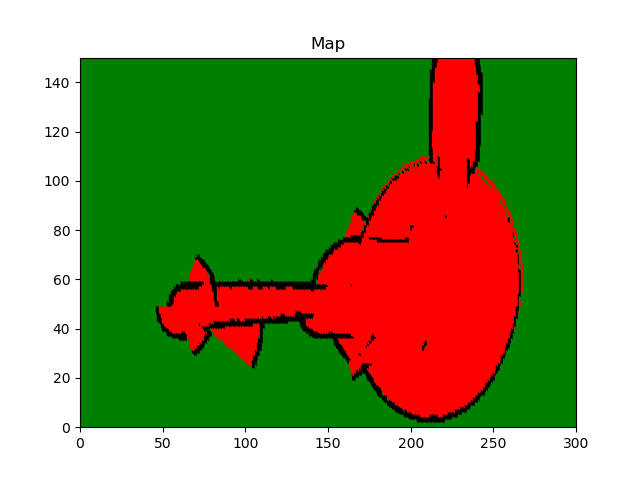

# RoboND Occupancy Grid Mapping
This is the C++ implementation of occupancy grid mapping algorithm lectures of Udacity's Robotics Software Engineer Nanodegree

There are two C++ files. `occupancy_grid.cpp` file includes implementation of occupancy grid mapping algorithm and visualization of the created map. It
uses matplotlib library of Python to visualize map. `multi_sensor.cpp` is a script for multiple sensor fusion.

### Compiling
To compile occupancy grid mapping write below command to terminal:

```sh
$ g++ occupancy_grid.cpp -std=c++11 -I/usr/include/python2.7 -lpython2.7
```

To compile sensor fusion write below command to terminal:

```sh
$ g++ multi_sensor.cpp
```

### Generated Map


